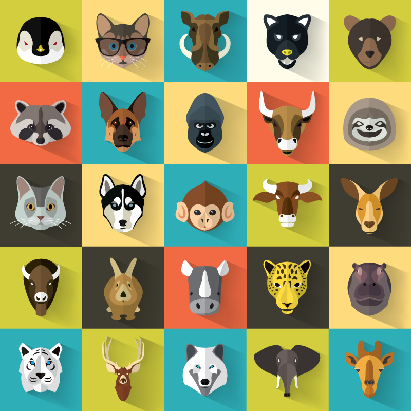

#PROJECT#1  
##GAME NAME: 
_____
###STARTING SCREEN --->
- The player is asked to **ENTER NAME**:
- Then gets to **choose** one of these avatar images :

_____

____

###STARTING GAME --->
- Large **GAME START** button
- Game starts after the count down
- **Instructions will be here:** "Guess the image as fast as possible before the time runs out"

####START BUTTON IMAGE
______

______

#GAME --->
- Picture is in the middle of the page but only part of it will show.
- objective: within 1min guess as many pictures as possible.

###SCORE --->
- Have player **name** and **avatar** stored on a "high score" list.
- Players can play again to achieve highest score.

